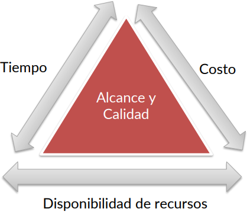

# 1. Explique con sus palabras en qué consiste un proyecto.

Un proyecto es una secuencia de actividades conectadas por un único objetivo, que deben completarse siguiendo un tiempo, un presupuesto y una serie de especificaciones.

La definición que tuvimos que repetir 20 veces en la teoría:

*Un proyecto es una secuencia de actividades únicas, complejas y conectadas que tienen un objetivo y deben ser completadas en un tiempo específico, dentro del presupuesto y acorde a las especificaciones.*

# 2. Indique cuál es el trabajo de un líder de proyecto. Nombre al menos cinco tareas del mismo.

El líder del proyecto es el encargado de dirigir el proyecto, coordinando su tiempo, recursos y presupuesto. Su principal objetivo es alcanzar los resultados esperados en los plazos establecidos, preservando la calidad del producto.

Algunas de sus tareas son:
1. Desarrollar el plan del proyecto.
2. Administrar los recursos humanos y materiales.
3. Mantener la comunicación entre todas las partes involucradas.
4. Gestionar los riesgos del proceso.
5. Asegurar la calidad del producto y del proceso.

# 3. Enumere y explique cuáles son los parámetros o restricciones que afectan a los proyectos.

* **Alcance:** establece los límites del proyecto. Define lo que va a hacerse y lo que no. Cuanto mayor sea el alcance, se necesita más tiempo y recursos para poder llevar a cabo el proyecto.
* **Recursos:** incluye los activos necesarios para poder llevar a cabo el proyecto, los cuales pueden ser personal, facilidades físicas o artefactos. Conocer los recursos es necesario para el proceso de planificación, ya que influye directamente en los demás parámetros.
* **Tiempo:** determina el tiempo necesario para la finalización del proyecto, como también plazos de entrega y fechas específicas. Establecer plazos cortos requiere de mayor presupuesto y recursos, mientras que tener tiempos muy largos puede traer desventajas comerciales.
* **Costo:** está conformado por todos los gastos monetarios dentro del presupuesto del proyecto. Generalmente, los clientes asocian los resultados de un proyecto con el presupuesto gastado en este.
* **Calidad:** garantiza tanto la calidad del producto como del proceso de su desarrollo.

# 4. ¿En qué consiste el "Triángulo de alcance"? Explique el concepto.

El triángulo de alcance está formado por los 5 parámetros que afectan los proyectos:
* Sus 3 lados representan a los recursos, el tiempo y el costo.
* Su superficie representa al alcance y la calidad.

Este concepto implica que, al aumentar la superficie del triángulo (su alcance), indirectamente van a aumentar también sus lados (que representan a los demás parámetros); además, alargar uno de los lados va a afectar a los demás. Por lo tanto, al no definir correctamente el alcance de antemano, si se intenta modificar durante el proceso del proyecto se termina afectando toda la planificación.

El aumento del alcance también puede conllevar al deterioro de la calidad.

# 5. Identifique las etapas que forman parte de un proyecto y describa en pocas palabras en qué consiste cada una.

# 6. Explique cómo se pueden clasificar los proyectos de software.

Los proyectos se clasifican agrupándolos según algunas de sus características, entre las cuales se incluyen su duración, riesgo, complejidad, valor comercial, costo, etc.

Un ejemplo usado de clasificación sería:

| Tipo | Duración | Riesgo | Complejidad | Tecnologías | Problemas |
| ---- | -------- | ------ | ----------- | ----------- | --------- |
| A | +18 meses | Alto | Alta | De avanzada | Garantizados |
| B | 9-18 meses | Medio | Media | Actual | Probables |
| C | 3-9 meses | Bajo | Baja | Mejoras | Algunos |
| D | -3 meses | Muy bajo | Muy baja | Práctica | Ninguno |

# 7. Enumere y ejemplifique causas de fracaso de proyectos.

Las causas por las que un proyecto fracasa son varias, y lo más común es que se produzcan en la etapa de planificación. Estas se pueden clasificar en:

* **Falta de atención:** se ignoran ciertos parámetros o características del producto final. Los casos más comunes son no prestar atención a los casos del negocio, la calidad o los entregables.
* **Mala planificación:** desde el inicio del proyecto hubo ambigüedades o definiciones inadecuadas. Los casos más comunes son la mala distribución de responsabilidades y coordinación de recursos.
* **Mala estimación:** al planificar el proyecto no se definieron correctamente los parámetros de este. Usualmente hay problemas con la duración y los gastos.
* **Faltas:** a lo largo del proyecto se ignoran o a propósito no se siguen ciertas prácticas que mantienen el equilibrio del proyecto, tales como la comunicación y compromiso de los interesados o el control de calidad y avance.

# 8. Revise y compare las definiciones de administración de proyectos vistas en clase y otras disponibles en la Web (debe citar las definiciones utilizadas).

1. **PRINCE:** *Es la planificación, la delegación, el seguimiento y el control de todos los aspectos del proyecto y la motivación de los participantes para alcanzar los objetivos del proyecto dentro de los objetivos de rendimiento esperados en términos de tiempo, costo, calidad, alcance, beneficios y riesgos.*
2. **PMI:** *La administración de proyectos es la aplicación de conocimientos, habilidades, herramientas y técnicas a actividades de proyectos para satisfacer los requisitos del proyecto. La administración del proyecto se logra mediante el uso de los procesos tales como: iniciar, planificar, ejecutar, controlar y cerrar.*
3. **METHOD 123:** *Se trata de las habilidades, herramientas y procesos de gestión necesarios para llevar a cabo un proyecto con éxito.*

## Identificar aspectos comunes.

El aspecto común más importante es el objetivo final de la administración de proyectos, siendo este el éxito y la satisfacción de los requisitos u objetivos del proyecto.

Las definiciones también describen a la administración como un conjunto de habilidades, procesos y herramientas; por lo tanto, no podría considerarse algo "lineal" o realizable de una única manera.

## Identificar aspectos mencionados que considere importantes y justificar.

PRINCE aclara que el proyecto debe alcanzar sus objetivos dentro del rendimiento esperado en términos de tiempo, costo, calidad, etc. Esto implica la importante relación entre la administración del proyecto y su planificación, particularmente en la definición de sus parámetros. Por otro lado, es la única definición que menciona la motivación de los participantes, lo cual es fundamental no sólo desde el lado del personal sino también del cliente y demás involucrados.

PMI menciona en su definición el uso de los procesos de inicio, planificación, ejecución, control y cierre. Es la única definición que resalta el valor de la administración de proyectos como un proceso por etapas.

## Enumerar ventajas de una buena administración de proyectos.

* Reduce el costo y tiempos de entrega del producto final.
* Mejora la calidad del producto y del proceso.

# 9. Cite los desafíos de la administración de proyectos. Indique qué puede hacerse para cumplirlos.

* Gestionar proyectos con alto nivel de innovación.
* Complejidad del proyecto.
* Requerimientos ambiguos por parte de los clientes.
* Falta de competencias necesarias para el desarrollo en el equipo.
* Herramientas y técnicas inmaduras, difíciles de trabajar.
* Cumplir con plazos y regulaciones.
* Tratar con proveedores terceros y autoridades de nuestra organización.
* Administrar personal con distintos niveles de productividad, e intentar retenerlos a lo largo del proyecto.
* Administrar equipos distribuidos en distintos lugares, a veces incluso con lenguajes o culturas totalmente diferentes.

# 10. Mencione y explique con sus palabras cómo es el ciclo de vida de un proyecto.

El ciclo de vida del proyecto está formado por 5 etapas:

### Inicio

### Planificación

### Ejecución

### Control

### Cierre

# 11. Explique qué es un programa. Mencione diferencias entre programas y proyectos.

Un programa es un mecanismo administrativo en el que se agrupan varios proyectos gestionados de manera coordinada. El objetivo de esto es obtener un beneficio mayor que el que podría obtenerse gestionando cada proyecto independientemente.

| Proyecto | Programa |
| --- | --- |
| Alcance limitado con productos concretos | Alcance amplio y cambiante para satisfacer las expectativas de sus beneficios |
| Se intenta mantener el cambio al mínimo | Se esperan cambios y son aceptados |
| Éxito medido según su presupuesto, tiempo de entrega y productos cumpliendo las especificaciones | Éxito medido según el retorno de inversión (ROI) o nuevas capacidades y prestaciones para la organización |
| Liderazgo centrado en entregas y orientado hacia el cumplimiento de los criterios de éxito | Liderazgo centrado en gestionar las relaciones y resolver conflictos |
| Los líderes del proyecto gestionan y motivan al personal, además de planificar detalladamente la entrega de los productos y servicios | Los directores de programa dirigen a los líderes de proyecto y crean planes de alto nivel para orientar a los proyectos |

# 12. ¿Cuál es la relación entre la administración de programas y la administración de proyectos?

Un programa se administra buscando obtener un beneficio común para los proyectos que lo conforman. Por otro lado, administrar un proyecto conlleva obtener los resultados esperados de este.

Dicho esto, la correcta administración de un programa facilita la administración de los proyectos que lo conforman de distintas maneras:
* Define tareas interdependientes.
* Organiza el uso de recursos compartidos.
* Establece actividades de mitigación de riesgos en común.