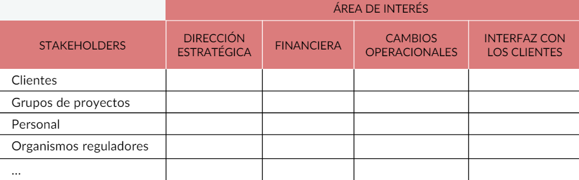
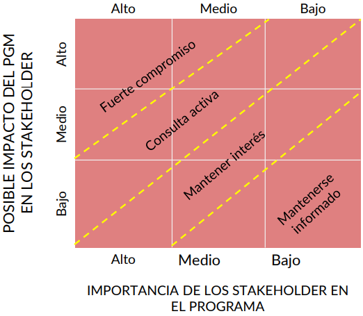

# 25.Explicar qué es la gestión de los beneficios y en qué consiste su enfoque.

La gestión de beneficios ayuda a que las partes interesadas se comprometan más con la correcta realización de los beneficios y sean responsables de añadirle valor.

El objetivo final de los proyectos y programas es obtener beneficios para las partes interesadas. Estos objetivos deben ser identificados, claramente definidos y vinculados a resultados estratégicos; para esto, es necesario que sean específicos, medibles, realizables, realistas y limitados en el tiempo (SMART: *Specific, Measurable, Attainable, Realistic, Time-bounded*).

# 26.¿Cuáles son las características principales de la gestión de los interesados?

La gestión de stakeholders es el proceso de identificar y comunicarse efectivamente con las personas o grupos interesados en el resultado de un proyecto u programa. Entre sus características se encuentran:
* Los *stakeholders* deberán analizarse y comprometerse para alcanzar los objetivos del programa en términos de apoyo y compromiso.
* La gestión incluye la planificación de comunicaciones, el uso e identificación efectiva en los diferentes canales e comunicación y las técnicas que permiten alcanzar los objetivos del programa.
* La comunicación con los *stakeholders* debe ser clara, consistente, enfocada en lo esencial y comprensible para todos.
* La gestión debe verse como proceso continuo en todas las iniciativas del programa, vinculado al ciclo de vida de la iniciativa y controles de la institución.

# 27.Indicar cuáles son los objetivos de la gestión de los interesados y a qué preguntas responde.

Los principales objetivos de la gestión de *stakeholders* responden a las preguntas:

1. **¿Quién?:** identificar *stakeholders*.
2. **¿Qué?:** crear y analizar sus perfiles.
3. **¿Cómo?:** definir estrategias para su participación.
4. **¿Cuándo?:** planificar su participación en ciertas etapas del proyecto.

# 28.¿De qué forma se representa la identificación de los interesados y sus intereses? Ejemplifique.

El **mapa de *stakeholders*** es una estructura usada para clasificar a los interesados según el grupo al que pertenecen y su interés para el proyecto. Esta tiene la siguiente estructura:

Primero deben identificarse los grupos de *stakeholders*, y luego se señala para cada uno las áreas de interés dentro del proyecto.

# 29.Indique qué datos se incluyen al momento de crear una matriz de impacto y qué aporta el análisis de los mismos.

La **matriz de impacto** analiza la importancia e impacto que un grupo de *stakeholders* tiene en el proyecto.

Según su nivel de importancia y el impacto que puedan tener, se les clasifica en alguna de las áreas de la matriz:

# 30.¿Qué datos tiene un plan de comunicación dentro de la gestión de los interesados? Mencione posibles canales de comunicación.

Al igual que un plan de gestión, al elaborar un plan de comunicación deben responderse las siguientes preguntas:
* ¿Qué se comunicará?
* ¿Cómo se comunicará?
* ¿Quién comunicará?
* ¿Cuándo se comunicará?

El plan de comunicación se utiliza para planificar y monitorear las actividades de comunicación durante la ejecución del programa. Algunos ejemplos de canales de comunicación son:
* **Seminarios o workshops:** permiten contacto directo con los *stakeholders*.
* **Prensa y medios:** para públicos externos y muy amplios.
* **Boletines, anuncios o informes:** se utilizan para comunicar información general y específica con *stakeholders* particulares.
